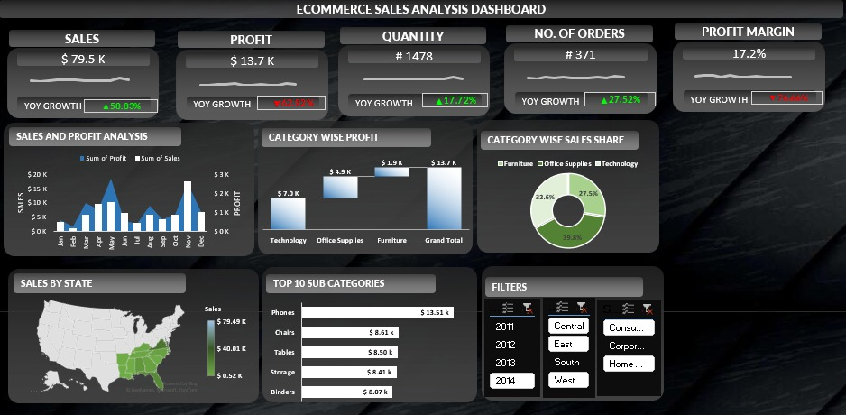

# E-Commerce Sales Analysis Dashboard

## Overview
This project is an interactive Microsoft Excel dashboard created to analyze e-commerce sales performance.

## Tools Used
- Microsoft Excel
- Pivot Tables
- Pivot Charts
- Slicers
- Conditional Formatting

## Dashboard Features
- KPI Cards
- Sales & Profit Analysis
- Category-wise Profit
- Category-wise Sales Distribution
- Sales by State (Map)
- Top 10 Sub-Categories
- Interactive Filters

## Dashboard Preview

